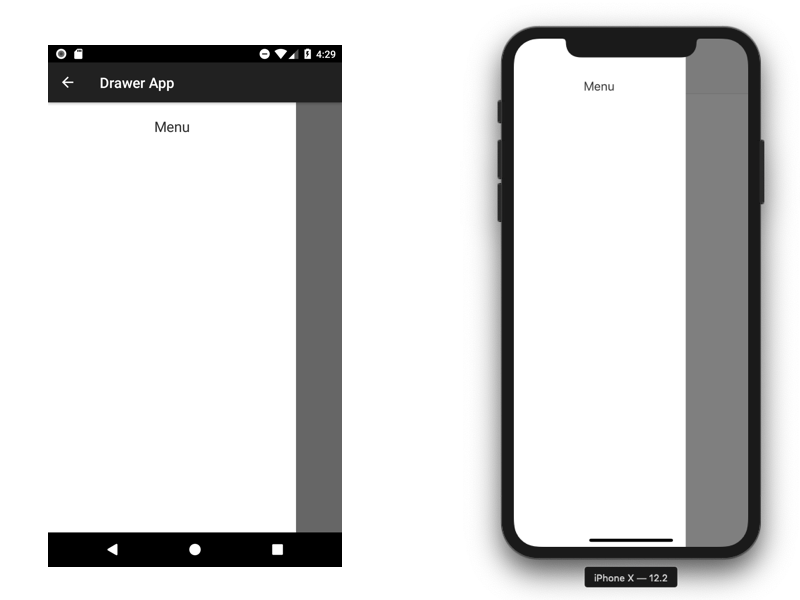

# Drawer App
This sample app demonstrates how to make an app using a drawer, or commonly known as hamburger menu, as the main method of navigation. On Android the default DrawerLayout is availble, however natively on iOS this doesn't exist. Because of that we've added a custom controller that mimics a drawer while keeping as much code cross platform as possible.

The menu itself is its own controller as well, which works cross platform and is included as the `<LeftView>` on Android and as an overlay on iOS.

The overlay on iOS is a transparent `<Window>` with an animate in and out of the menu. You can see the iOS specific code in the `/ios/drawer` controller.

### Usage
This sample app is intended as a template to how to use a cross platform app drawer app. The basis of the app is a `<NavigationWindow>` so you could use the `<NavigationWindow>` as the navigation interface. When comparing production apps that have a drawer menu use different strategies. Most of them either open the new window using the NavigationWindow or use `modal` windows. For android this would be `Alloy.createController('myController').getView().open()` and for iOS you'd need to set the `modal` flag.

#### Menu
The menu is a view located in the menu controller. This is a view that is wrapped in the `<LeftView>` property on Android and wrapped in a `<Window>` on iOS. Furthermore there is an extra nested `<View>` in the menu controller so padding can be generated based on `safeAreaPadding` on iOS (see the `/ios/drawer` controller). 

If you want to use that extra padding to your advantage you can just nest your entire menu content inside  `<View id="menuContent">` and it will automatically follow the `safeAreaPadding`.

The _width_ of the menu is currently defined as deviceWidth minus 100dp on iPhones. On iPad it is defined as half the deviceWidth. This can be fully configured in the `/ios/drawer` controller. On Android the width can be defined by setting `leftWidth` on the DrawerLayout.